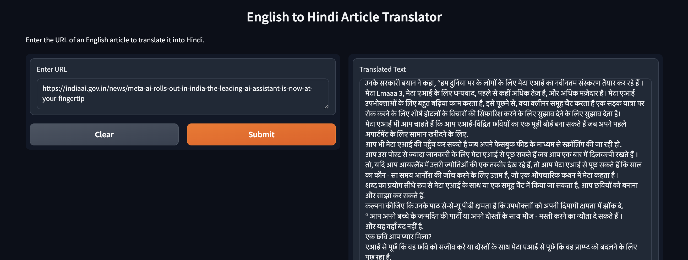

# English to Hindi Article Translator

## Overview

This project provides a web-based application for translating articles from English to Hindi using machine learning models. The application utilizes Hugging Face’s MarianMT model for translation and leverages Gradio to create an interactive web interface for users to input URLs of articles and receive translations.

## Features

- **Article Extraction**: Extracts article content from a provided URL using `newspaper3k`.
- **Language Detection**: Detects the language of the extracted article.
- **Translation**: Translates English articles to Hindi using MarianMT from Hugging Face.
- **Summarization**: Summarizes the translated article.
- **Evaluation**: Provides BLEU, ROUGE, and TER scores to evaluate translation quality.
- **Web Interface**: User-friendly Gradio interface for easy interaction.

## Installation

Ensure you have the following libraries installed:

```bash
pip install indic-nlp-library newspaper3k transformers langdetect sentencepiece torch sacrebleu rouge-score pyterrier nltk gradio
```

## Setup

1. **Obtain Hugging Face Token**:
   - Create a Hugging Face token by going to [Hugging Face Tokens](https://huggingface.co/settings/tokens).
   - Copy the generated token.

2. **Add Token to Colab Secrets**:
   - Open your Google Colab notebook.
   - Navigate to the **Secrets** section.
   - Add a new secret with the name `HF_TOKEN` and paste your Hugging Face token in the value field.
   - Restart the Colab runtime.

## Usage

1. **Run the Script**:
   - Open the provided script in Google Colab or your preferred Python environment.
   - Execute the code to start the Gradio interface.

2. **Interacting with the Interface**:
   - Enter the URL of an English article in the input field of the Gradio interface.
   - The translated Hindi article and evaluation metrics will be displayed.


## Evaluation Metrics

The project evaluates the translation quality using the following metrics:

- **BLEU Score**: Measures n-gram overlap between the generated and reference text.
- **ROUGE Scores**: Measures overlap of unigrams, bigrams, and longest common subsequences.
- **TER Score**: Measures the number of edits needed to convert the generated text into the reference text.

## Interface

  

